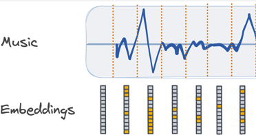
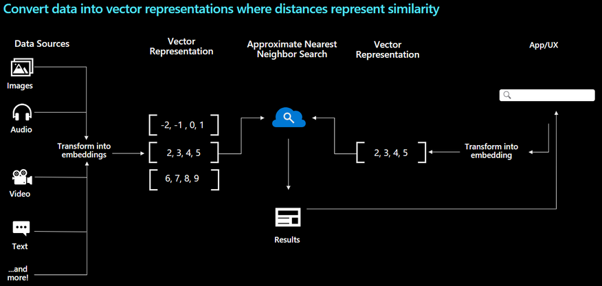

# Audio embeddings

**Vector embeddings** are a way of representing content such as text or images as vectors of real numbers in a high-dimensional space. These embeddings are often learned from large amounts of textual and visual data using machine learning algorithms like neural networks. Each dimension of the vector corresponds to a different feature or attribute of the content, such as its semantic meaning, syntactic role, or context in which it commonly appears. By representing content as vectors, we can perform mathematical operations on them to compare their similarity or use them as inputs to machine learning models.

Azure Cognitive Search today doesn't provide a way to vectorize documents and queries, leaving it up to you to pick the best embedding model for your data. In this example we will use **PANNS (Large scale Pretrained Audio Neural Networks) to generate the embeddings.**

We can use audio embeddings to find similarities between audio files.
We are going to use here Azure Cognitive Search and its new vector store.

## Notebooks
- Identification on an audio file based on a catalog of audio files: 
<a href="Audio%20Search%20with%20audio%20embeddings%20and%20Azure%20Cognitive%20Search.ipynb">Audio search with Azure Cognitive Search</a>
- Sound anomaly detection: 
<a href="Audio anomalies detection.ipynb">Audio anomalies detection</a>

## Steps
1. Generation audio embeddings on an audio files catalog
2. Create an Azure Cognitive search vector store index
3. Upload the embeddings into an Azure Cognitive Search index
4. Do some sound search using an audio file

## Business applications
- Gender detection
- Sentiment analysis
- Predictive maintenance
- Anomaly detection

## To learn more
- https://learn.microsoft.com/en-us/azure/search/search-what-is-azure-search
- https://techcommunity.microsoft.com/t5/azure-ai-services-blog/announcing-vector-search-in-azure-cognitive-search-public/ba-p/3872868

 
 
17-July-2023 
 
Serge Retkowsky | serge.retkowsky@microsoft.com | https://www.linkedin.com/in/serger/
